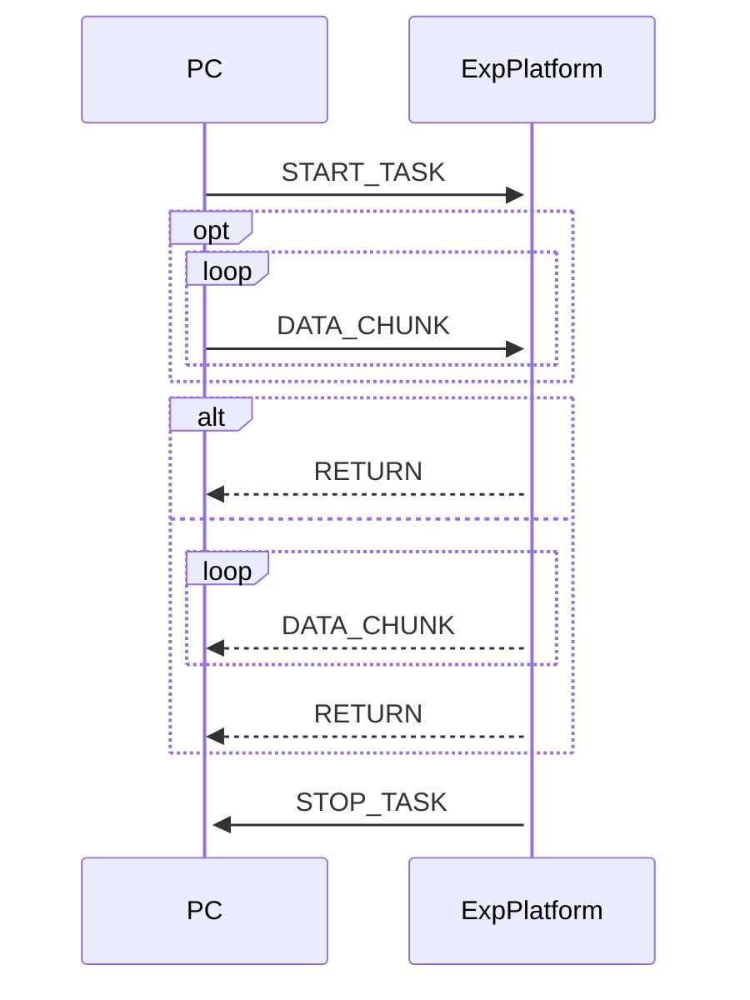

# **RCP Specification**
**Transport**: USB UART (8N1)
**Endianness**: Little-endian
**Max Chunk Size**: Configurable (32-65535 bytes, default 256)
**Checksum**: Optional CRC-8 (Polynomial: 0x07)

---

### **Message Header (6 bytes)**
| Field       | Size (bytes) | Description                                  |
|-------------|--------------|----------------------------------------------|
| sync        | 1            | Sync byte (0xAA)                             |
| type        | 1            | Message type ID                              |
| flags       | 1            | Bitfield (see below)                         |
| msg_id      | 1            | Message ID (0-255)                           |
| payload_len | 2            | Payload length (little-endian)               |

---

### **Message Types**
| ID (Hex) | Message Type  |
|----------|---------------|
| 0x01     | START_TASK    |
| 0x02     | STOP_TASK     |
| 0x03     | RETURN        |
| 0x04     | DATA_CHUNK    |
| 0x05     | ACK           |
| 0x06     | NAK           |
| 0x07     | HANDSHAKE     |

---

### **Flags Bitfield**
| Bit Index | Field    |
|-----------|----------|
| 0         | NEED_ACK |
| 1         | HAS_CRC  |
| 2         | reserved |
| 3         | reserved |
| 4         | reserved |
| 5         | reserved |
| 6         | reserved |
| 7         | reserved |

---

# **Message Specification**

### **OPEN_TASK:**
```
sync    type    flags   msg_id  payload_len |   checksum (if enabled)
AA      04      ...     ...      ...        |   ...
```

---

### **CLOSE_TASK:**
```
sync    type    flags   msg_id  payload_len |   checksum (if enabled)
AA      05      ...     ...     ...         |   ...
```

---

### **RETURN:**
```
sync    type    flags   msg_id  payload_len |   return_code    function_id    caller_msg_id   checksum (if enabled)
AA      02      ...     ...     1           |   ...            ...            ...             ...

ReturnCode: 0=Success, 1=Error, 2=Invalid Function
```

---

### **DATA_CHUNK:**
```
sync    type    flags   msg_id  payload_len |   task_id     data_id   data    checksum (if enabled)
AA      03      ...     ...     ...         |   ...           ...       ...     ...
```

---

### **ACK:**
```
sync    type    flags   msg_id  payload_len |   msg_id      checksum (if enabled)
AA      06      ...     ...     ...         |   ...         ...
```

---

### **NACK:**
```
sync    type    flags   msg_id  payload_len |   msg_id      checksum (if enabled)
AA      07      ...     ...     ...         |   ...         ...
```

---

### **HANDSHAKE:**
```
sync    type    flags   msg_id  payload_len |   version     capabilities    checksum (if enabled)
AA      08      ...     ...     ...         |   ...         ...             ...
```

---

# **State Machines**

### **Tasks:**


```mermaid
sequenceDiagram
  PC->>+ExpPlatform: START_TASK
  opt
      loop
        PC->>ExpPlatform: DATA_CHUNK
      end
  end
  alt
    ExpPlatform-->>PC: RETURN
  else
    loop
      ExpPlatform-->>PC: DATA_CHUNK
    end
    ExpPlatform-->>PC: RETURN
  end
   ExpPlatform->>+PC: STOP_TASK
```

---

### **Error Handling**
| Error Condition       | Action                                  |
|-----------------------|-----------------------------------------|
| Invalid DataID        | NAK with error code                     |
| Missing chunk         | Request retransmit                      |
| Stream overflow       | Close stream with error status          |
| Memory exhaustion     | Abort transfer with error               |
| Invalid FuncID        | Skip call, continue execution           |

---

### **Implementation Guidelines**

#### **1. Data Manager**
```c
typedef struct {
    uint8_t data_id;
    uint32_t total_size;
    uint32_t received;
    uint8_t* buffer;
    bool is_stream;
} DataTransfer;

typedef struct {
    uint8_t stream_id;
    uint8_t direction;
    uint32_t bytes_transferred;
} StreamChannel;
```

#### **2. Call Processing**
```python
def process_call(msg):
    if msg.arg_count > 0 and msg.args[0] == DATA_ID_MARKER:
        data_id = msg.args[1]
        wait_for_data_completion(data_id)
        args = get_data_buffer(data_id)
    else:
        args = msg.args[2:]
    execute_function(msg.func_id, args)
```

#### **3. Memory Management**
- Pre-allocate buffers for known data sizes
- Use circular buffers for streams
- Implement garbage collection for completed transfers

---

### **Performance Characteristics**
| Data Size      | Transfer Method         | Overhead       | Use Case               |
|----------------|-------------------------|----------------|------------------------|
| <64 bytes      | Inline                  | 5-7 bytes      | Simple calls           |
| 64-65535 bytes | Single DATA_CHUNK      | 8-10 bytes     | Medium transfers       |
| >65535 bytes   | Multi-chunk             | 8-10 bytes/chunk | Large transfers      |
| Streams        | Continuous chunks       | 8-10 bytes/chunk | Real-time data       |

---

### **Final Notes**
This specification provides:
1. **Unlimited data transfers** for all call types
2. **Unified chunking mechanism** for both arguments and returns
3. **First-class streaming support**
4. **Efficient small data handling**
5. **Clean separation of concerns**
6. **Comprehensive error handling**

