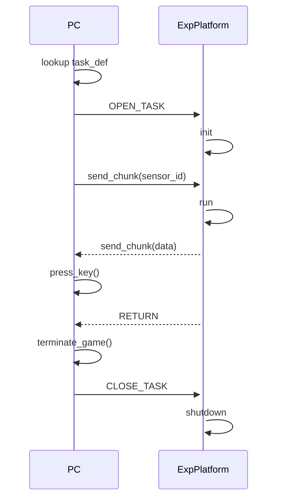
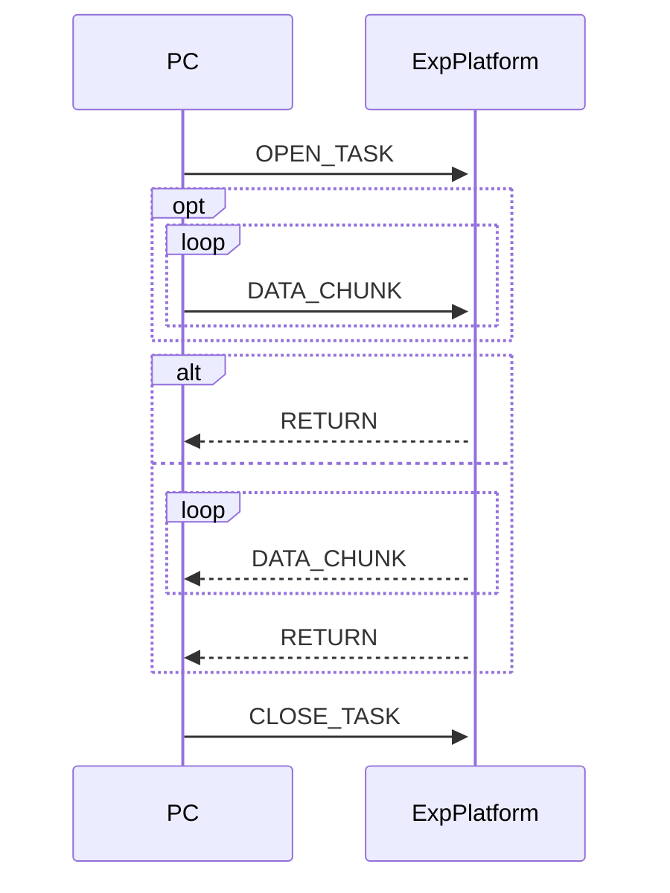

# **RCP Specification**
**Transport**: USB UART (8N1)
**Endianness**: Little-endian
**Max Chunk Size**: Configurable (32-65535 bytes, default 256)
**Checksum**: Optional CRC-8 (Polynomial: 0x07)

### **Main idea**
The protocol is based around tasks.
It has two meanings:
- it has a definition
- it can be runable(executable)

In the following evrerything related to task defininition will be explicitely prefixed by task_def
And everything related to a running instance is called 

**Remark:** We can have many running instances of a single task_def at a time

## use case Example 
From the hardware  we can have such a task_def

```py
@task_def(task_def_id=1)
class SensorTaskDevice:

    def init(self):
        self.sensor_started = True

    def run(self, sensor_id: int):
        data = query_sensor_data(sensor_id)
        send_chunk(data)
        send_return(0)

    def shutdown(self):
        reset_sensor()
```
From the PC we can have such a task_def

```py
@task_def(task_def_id=1)
class SensorTaskHost:

    def on_opened(self):
        send_chunk(sensor_id)

    def on_data_chunk(self, data):
        press_key()

    def on_return(self, return_code):
        terminate_game()
        close_task()
```



```mermaid
sequenceDiagram
  PC->>PC: lookup task_def
  PC->>+ExpPlatform: OPEN_TASK
  ExpPlatform->>ExpPlatform: init
  PC->>ExpPlatform: send_chunk(sensor_id)
  ExpPlatform->>ExpPlatform: run
  ExpPlatform-->>PC: send_chunk(data)
  PC->>PC: press_key()
  ExpPlatform-->>PC: RETURN
  PC->>PC: terminate_game()
  PC->>ExpPlatform: CLOSE_TASK
  ExpPlatform->>ExpPlatform: shutdown
```


---

### **Message Header (6 bytes)**
| Field       | Size (bytes) | Description                                  |
|-------------|--------------|----------------------------------------------|
| sync        | 1            | Sync byte (0xAA)                             |
| type        | 1            | Message type ID                              |
| flags       | 1            | Bitfield (see below)                         |
|task_id      | 1            | ID referencing the running instance of a task(0-255)|
| msg_id      | 1            | Unique reference to a message(except ACK,NACK) within a task|
| payload_len | 2            | Payload length (little-endian)               |

---

### **Message Types**
| ID (Hex) | Message Type  |
|----------|---------------|
| 0x01     | START_TASK    |
| 0x02     | CLOSE_TASK    |
| 0x03     | RETURN        |
| 0x04     | DATA_CHUNK    |
| 0x05     | ACK           |
| 0x06     | NAK           |
| 0x07     | HANDSHAKE     |

---

### **Flags Bitfield**
| Bit Index | Field    |
|-----------|----------|
| 0         | NEED_ACK |
| 1         | HAS_CRC  |
| 2         | reserved |
| 3         | reserved |
| 4         | reserved |
| 5         | reserved |
| 6         | reserved |
| 7         | reserved |

---

# **Message Specification**

### **OPEN_TASK:**
```
sync    type    flags   task_id  msg_id  payload_len |   func_id   checksum (if enabled)
AA      01      ...     ...      ...    ...         |   ...       ....
```

---

### **CLOSE_TASK:**
```
sync    type    flags   task_id  msg_id  payload_len |   checksum (if enabled)
AA      02      ...     ...     ...                 |   ...
```

---

### **RETURN:**
```
sync    type    flags   task_id  msg_id  payload_len |   return_code    checksum (if enabled)
AA      03      ...     ...             ...         |   ...            ... 

ReturnCode: 0=Success, 1=Error, 2=Invalid Function
```

---

### **DATA_CHUNK:**
```
sync    type    flags   task_id  msg_id  payload_len |   data    checksum (if enabled)
AA      05      ...     ...      ...     ...         |   ...     ...    
```

---

### **ACK:**
```
sync    type    flags   task_id  msg_id  payload_len |   checksum (if enabled)
AA      06      ...     ...      ...     ...         |   ...
```

---

### **NACK:**
```
sync    type    flags   task_id  msg_id  payload_len |   code    checksum (if enabled)
AA      07      ...     ...      ...     ...         |   ...     ...
```
code: error code 
---

### **HANDSHAKE:**
```
sync    type    flags   task_id  msg_id  payload_len |   version     capabilities    checksum (if enabled)
AA      08      ...     ...      ...     ...         |   ...         ...             ...
```

---

# **State Machines**

### **Tasks:**


```mermaid
sequenceDiagram
  PC->>+ExpPlatform: OPEN_TASK
  opt
      loop
        PC->>ExpPlatform: DATA_CHUNK
      end
  end
  alt
    ExpPlatform-->>PC: RETURN
  else
    loop
      ExpPlatform-->>PC: DATA_CHUNK
    end
    ExpPlatform-->>PC: RETURN
  end
   PC->>ExpPlatform: CLOSE_TASK
```
---

### **Error Handling**
| Error Condition       | Action                                  |
|-----------------------|-----------------------------------------|
| Invalid TaskID        | NAK with error code                     |
| Missing chunk         | Request retransmit                      |
| Stream overflow       | Close stream with error status          |
| Memory exhaustion     | Abort transfer with error               |
| Invalid task_def_id       | Skip call, continue execution           |

---

### **Implementation Guidelines**


#### **3. Memory Management**
- Pre-allocate buffers for known data sizes
- Use circular buffers for streams
- Implement garbage collection for completed transfers

---

### **Performance Characteristics**
| Data Size      | Transfer Method         | Overhead         | Use Case               |
|----------------|-------------------------|------------------|------------------------|
| 64-65535 bytes | Single DATA_CHUNK       | 8-10 bytes       | Medium transfers       |
| >65535 bytes   | Multi-chunk             | 8-10 bytes/chunk | Large transfers        |
| Streams        | Continuous chunks       | 8-10 bytes/chunk | Real-time data         |

---

### **Final Notes**
This specification provides:
1. **Unlimited data transfers** for all call types
2. **Unified chunking mechanism** for both arguments and returns
3. **First-class streaming support**
4. **Efficient small data handling**
5. **Clean separation of concerns**
6. **Comprehensive error handling**

